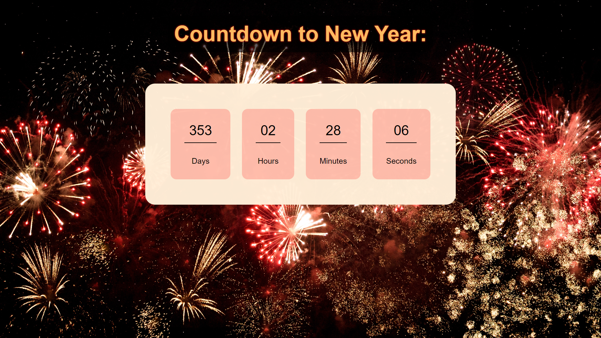

# CountdownNewYear
Repo for a javascript clock that countdown to new year! Once it reachs 0 it adds one year again to began the countdown.

[Visualize](https://geraldopmj.github.io/AnimatedLogo/)

# Resources used:

Background image: https://www.pexels.com/photo/photo-of-fireworks-display-2526105/

# Technology used:

- Javascript
- HTML
- CSS
- Git e Github

## Contact:

geraldo.pmj@gmail.com

## Preview:

